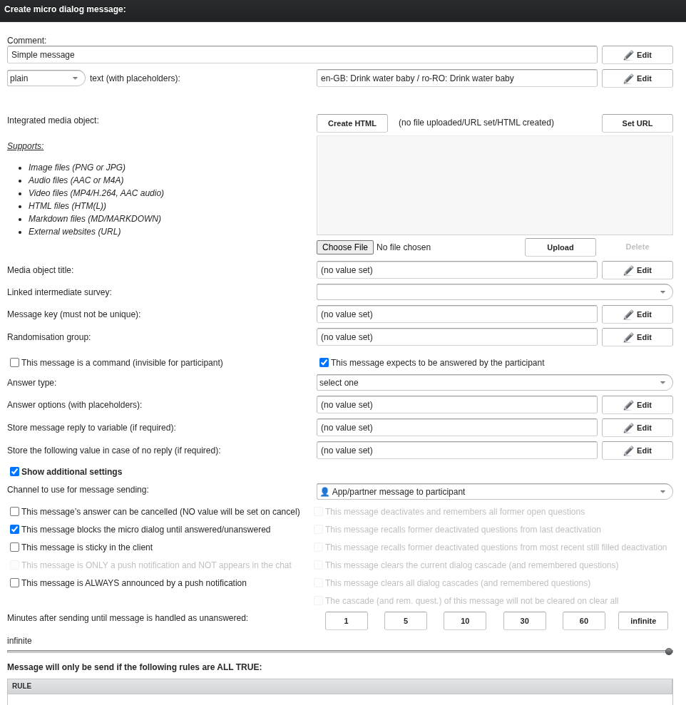
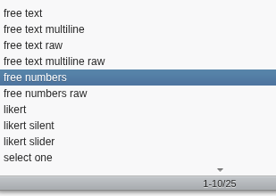
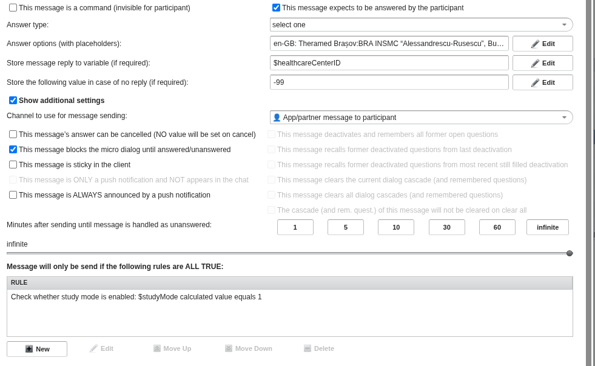
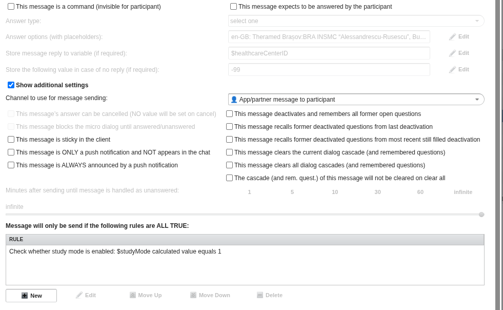
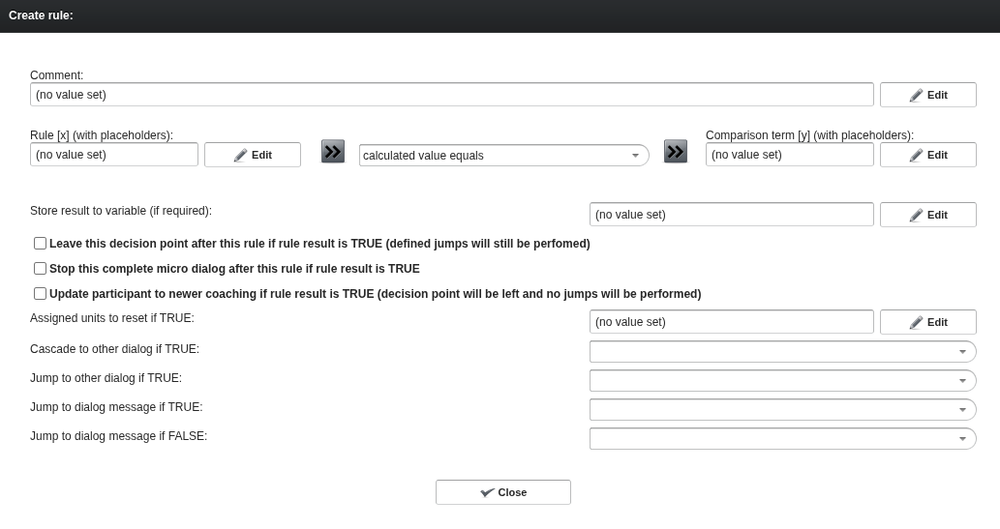

UKBB notes vault 
===============

File created on the 2026-10-01 14:05

### Rules

Each rule is one of four types: Daily, Periodic, User interaction and unnexpected message.

It seems to be possible to add rules outside of these four parameters -- Do we want this?
Rules nest to form an AND gate, and some rules are pure, which mean they do not trigger any message directly just pass along the rule to the nested children if it succedes.

For a non-pure rule, there are four options: "Send message if rule result is TRUE", "Start microdialog if rule result is TRUE", "Mark case as solved", "Finish coaching".
These options are not properly documented in the pathmate website, but we can infer somethings from it.

For instance, if the "Send message if rule result is TRUE" option is selected, then the "message group" field is open, as well as timing options, not-answered handles, rules if participant answers and does not answer etc. There the messages or microdialogs can be triggered again. It is allowed for a microfialog to be triggered but no microdialog field is given

The weird thing is that even after unselecting the "start microdialog if result is true" option, the name "$participantNextMicroDialogIdentifier" is there, which I am not sure what it means. Also the rules if participant answers or does not answer seem to remain inactive, as it seems everything is handled by the microdialog.

### Variables
Seems to be a very simple thing to model, the only things that we can do is change some properties of each variable, which is privacy, access and syncing, which I don't really know what they mean but I am not convinced can play a role in the overall functionality of the chatbot. We can also manage the starting value of the variable.

### Microdialogs
These are composed of Messages, Decision Points, or Events.

#### Messages

Messages are just text, or can be HTMLs that support many media types, as well as randomization groups.

Messages can also be invisible for participants, what is called "a command". This toggle is independent of all the other toggles.

##### Expected answer

A message can also expect to be answered by a participant, and there a lot of timing questions come about. Answer type can be one of 25 different types, here are 10

Are these documented? I don't know, to be investigated.
Answer options, which are essentially text boxes that can be localized.
Which variable will store the value of the answer, and what is the default value if there is no answer.

##### Additional settings

View if message expects to be answered by participant

View if message does not expect to be answered by participant

- The message can be cancelled (what does that mean?) only available if there is answer
- The message can block the micro dialog, only available if there is answer
- The message can be sticky in the client (what does that mean?)
- This message is only a push notification and does not appear on the chat, only available if NO ANSWER is expected
- This message is ALWAYS announced by a push notification

If the message is only a push notification, all remaining options are disabled

From the following, only zero or one can be selected
	Behaviour on memory
	- This message deactivates and remembers all former open questions, only available if NO ANSWER is expected
	- This message recalls former deactivated questions from last deactivation, only available if NO ANSWER is expected
	- This message recalls former deactivated questions from most recent still filled deactivation (what!?), only available if NO ANSWER is expected

From the following, only zero or one can be selected
	Behaviour on cascade
	- This message clears the current dialog cascade and remembers questions (what!?), only available if NO ANSWER is expected
	- This message clears the all dialog cascade and remembers questions (what!?), only available if NO ANSWER is expected

- This cascade and remaining questions of this message will not be cleared on clear all (what!?), only available if NO ANSWER is expected

##### Rules
Messages can also have conditional rules that control if a message will be sent or not.
This is a set of rules that have no nesting (unlike the rules on the Rules tab) and from the labelling, this blocks the message if ALL rules are set to TRUE (And gate)

#### Decision points
Each decision point has a comment value, and an "Update transition point" which I have no idea what it is (please help)

Then it has a tree structure of rules, each rule has the following menu

If the rule is verified and possibly value is saved somewhere, then we can decide what to do regarding this microdialog (continue as intended, stop this micro dialog, or update participant to new coaching which I have no idea what it means...)

There seems to be a difference between "jump" and "cascade" but that is completely unclear to me and we need to understand that asap.

I think nested rules trigger their children if the parents are true, in a cascade of sorts.

If none of the checkboxes are checked, these jumps between dialogs in the microdialog if certain conditions are met, allowing for dynamic conversation flows based on participant interactions or other triggers.

#### Events
An Event has comment (sort of name, as always), event identifiers (which have to contain a dot I think in the beginning but I don't know where this is documented) and rules which trigger the event if all of the rules are TRUE.
I have no idea what the identifiers are... some backend functions? No idea

---
Extra screenshots: [rule editor, full modal](rule-editor-full.png), [message editor, full modal](message-editor-full.png).
Source: Raul's Obsidian note "Pathmate Navigation" (2026-10-01), copied by Kart.
