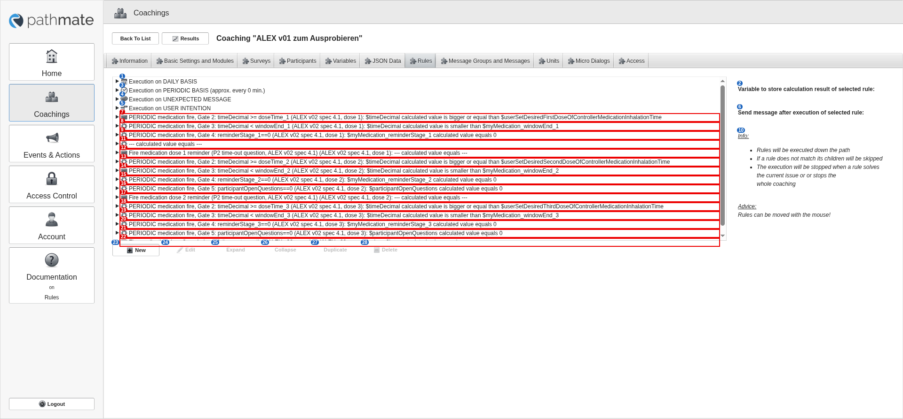

# 05 Rules tab (collapsed): the 4 sections and rules outside them

alex-sandbox, captured by doc_screens.py.

Blue numbers label each control; **red boxes** mark controls whose meaning is unknown.

| # | control | caption | greyed out | open question |
|---|---|---|---|---|
| 1 | rule | Execution on DAILY BASIS |  |  |
| 2 | label | Variable to store calculation result of selected rule: |  |  |
| 3 | rule | Execution on PERIODIC BASIS (approx. every 0 min.) |  |  |
| 4 | rule | Execution on UNEXPECTED MESSAGE |  |  |
| 5 | rule | Execution on USER INTENTION |  |  |
| 6 | label | Send message after execution of selected rule: |  |  |
| 7 | rule | PERIODIC medication fire, Gate 2: timeDecimal >= doseTime_1 (ALEX v02 spec 4.1, dose 1): $timeDecimal calculated value is bigger or equal than $userSetDesire... |  | Rule OUTSIDE the 4 execution sections: does PMCP ever run it? Should this be allowed? |
| 8 | rule | PERIODIC medication fire, Gate 3: timeDecimal < windowEnd_1 (ALEX v02 spec 4.1, dose 1): $timeDecimal calculated value is smaller than $myMedication_windowEnd_1 |  | Rule OUTSIDE the 4 execution sections: does PMCP ever run it? Should this be allowed? |
| 9 | rule | PERIODIC medication fire, Gate 4: reminderStage_1==0 (ALEX v02 spec 4.1, dose 1): $myMedication_reminderStage_1 calculated value equals 0 |  | Rule OUTSIDE the 4 execution sections: does PMCP ever run it? Should this be allowed? |
| 10 | label | Info: Rules will be executed down the path If a rule does not match its children will be skipped The execution will be stopped when a rule solves the current... |  |  |
| 11 | rule | --- calculated value equals --- |  | Rule OUTSIDE the 4 execution sections: does PMCP ever run it? Should this be allowed? |
| 12 | rule | Fire medication dose 1 reminder (P2 time-out question, ALEX v02 spec 4.1) (ALEX v02 spec 4.1, dose 1): --- calculated value equals --- |  | Rule OUTSIDE the 4 execution sections: does PMCP ever run it? Should this be allowed? |
| 13 | rule | PERIODIC medication fire, Gate 2: timeDecimal >= doseTime_2 (ALEX v02 spec 4.1, dose 2): $timeDecimal calculated value is bigger or equal than $userSetDesire... |  | Rule OUTSIDE the 4 execution sections: does PMCP ever run it? Should this be allowed? |
| 14 | rule | PERIODIC medication fire, Gate 3: timeDecimal < windowEnd_2 (ALEX v02 spec 4.1, dose 2): $timeDecimal calculated value is smaller than $myMedication_windowEnd_2 |  | Rule OUTSIDE the 4 execution sections: does PMCP ever run it? Should this be allowed? |
| 15 | rule | PERIODIC medication fire, Gate 4: reminderStage_2==0 (ALEX v02 spec 4.1, dose 2): $myMedication_reminderStage_2 calculated value equals 0 |  | Rule OUTSIDE the 4 execution sections: does PMCP ever run it? Should this be allowed? |
| 16 | rule | PERIODIC medication fire, Gate 5: participantOpenQuestions==0 (ALEX v02 spec 4.1, dose 2): $participantOpenQuestions calculated value equals 0 |  | Rule OUTSIDE the 4 execution sections: does PMCP ever run it? Should this be allowed? |
| 17 | rule | Fire medication dose 2 reminder (P2 time-out question, ALEX v02 spec 4.1) (ALEX v02 spec 4.1, dose 2): --- calculated value equals --- |  | Rule OUTSIDE the 4 execution sections: does PMCP ever run it? Should this be allowed? |
| 18 | rule | PERIODIC medication fire, Gate 2: timeDecimal >= doseTime_3 (ALEX v02 spec 4.1, dose 3): $timeDecimal calculated value is bigger or equal than $userSetDesire... |  | Rule OUTSIDE the 4 execution sections: does PMCP ever run it? Should this be allowed? |
| 19 | rule | PERIODIC medication fire, Gate 3: timeDecimal < windowEnd_3 (ALEX v02 spec 4.1, dose 3): $timeDecimal calculated value is smaller than $myMedication_windowEnd_3 |  | Rule OUTSIDE the 4 execution sections: does PMCP ever run it? Should this be allowed? |
| 20 | rule | PERIODIC medication fire, Gate 4: reminderStage_3==0 (ALEX v02 spec 4.1, dose 3): $myMedication_reminderStage_3 calculated value equals 0 |  | Rule OUTSIDE the 4 execution sections: does PMCP ever run it? Should this be allowed? |
| 21 | rule | PERIODIC medication fire, Gate 5: participantOpenQuestions==0 (ALEX v02 spec 4.1, dose 3): $participantOpenQuestions calculated value equals 0 |  | Rule OUTSIDE the 4 execution sections: does PMCP ever run it? Should this be allowed? |
| 22 | rule | Fire medication dose 3 reminder (P2 time-out question, ALEX v02 spec 4.1) (ALEX v02 spec 4.1, dose 3): --- calculated value equals --- |  | Rule OUTSIDE the 4 execution sections: does PMCP ever run it? Should this be allowed? |
| 23 | button | New |  |  |
| 24 | button | Edit | yes |  |
| 25 | button | Expand | yes |  |
| 26 | button | Collapse | yes |  |
| 27 | button | Duplicate | yes |  |
| 28 | button | Delete | yes |  |
