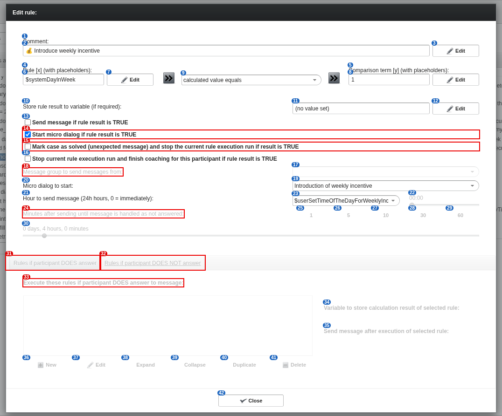

# 10 Rule editor (sender rule, as is)

alex-sandbox, captured by doc_screens.py. Rule: 💰 Introduce weekly incentive: $systemDayInWeek calculated value equals 1

Blue numbers label each control; **red boxes** mark controls whose meaning is unknown.

| # | control | caption | greyed out | open question |
|---|---|---|---|---|
| 1 | caption | Comment: |  |  |
| 2 | label | 💰 Introduce weekly incentive |  |  |
| 3 | button | Edit |  |  |
| 4 | caption | Rule [x] (with placeholders): |  |  |
| 5 | caption | Comparison term [y] (with placeholders): |  |  |
| 6 | label | $systemDayInWeek |  |  |
| 7 | button | Edit |  |  |
| 8 | label | 1 |  |  |
| 9 | filterselect | calculated value equals |  |  |
| 10 | label | Store rule result to variable (if required): |  |  |
| 11 | label | (no value set) |  |  |
| 12 | button | Edit |  |  |
| 13 | checkbox | Send message if rule result is TRUE |  |  |
| 14 | checkbox | Start micro dialog if rule result is TRUE |  | What happens to an open question from another dialog when this starts one? |
| 15 | checkbox | Mark case as solved (unexpected message) and stop the current rule execution run if result is TRUE |  | Does it also stop a periodic round, or only an unexpected-message round? |
| 16 | checkbox | Stop current rule execution run and finish coaching for this participant if rule result is TRUE |  |  |
| 17 | filterselect | (dropdown) | yes |  |
| 18 | label | Message group to send messages from: | yes | What is a message group, and how does it differ from a micro dialog? |
| 19 | filterselect | Introduction of weekly incentive |  |  |
| 20 | label | Micro dialog to start: |  |  |
| 21 | label | Hour to send message (24h hours, 0 = immediately): |  |  |
| 22 | caption | 00:00 | yes |  |
| 23 | filterselect | $userSetTimeOfTheDayForWeeklyIncentiveAnnouncement |  |  |
| 24 | label | Minutes after sending until message is handled as not answered: | yes | What happens when this time runs out, and when does it apply? |
| 25 | button | 1 | yes |  |
| 26 | button | 5 | yes |  |
| 27 | button | 10 | yes |  |
| 28 | button | 30 | yes |  |
| 29 | button | 60 | yes |  |
| 30 | caption | 0 days, 4 hours, 0 minutes | yes |  |
| 31 | tabsheet-tabitemcell | Rules if participant DOES answer | yes | When do the 'does answer' rules run, and on which message? |
| 32 | tabsheet-tabitemcell | Rules if participant DOES NOT answer | yes | When do the 'does NOT answer' rules run, and on which message? |
| 33 | label | Execute these rules if participant DOES answer to message: | yes | When do the 'does answer' rules run, and on which message? |
| 34 | label | Variable to store calculation result of selected rule: | yes |  |
| 35 | label | Send message after execution of selected rule: | yes |  |
| 36 | button | New | yes |  |
| 37 | button | Edit | yes |  |
| 38 | button | Expand | yes |  |
| 39 | button | Collapse | yes |  |
| 40 | button | Duplicate | yes |  |
| 41 | button | Delete | yes |  |
| 42 | button | Close |  |  |
