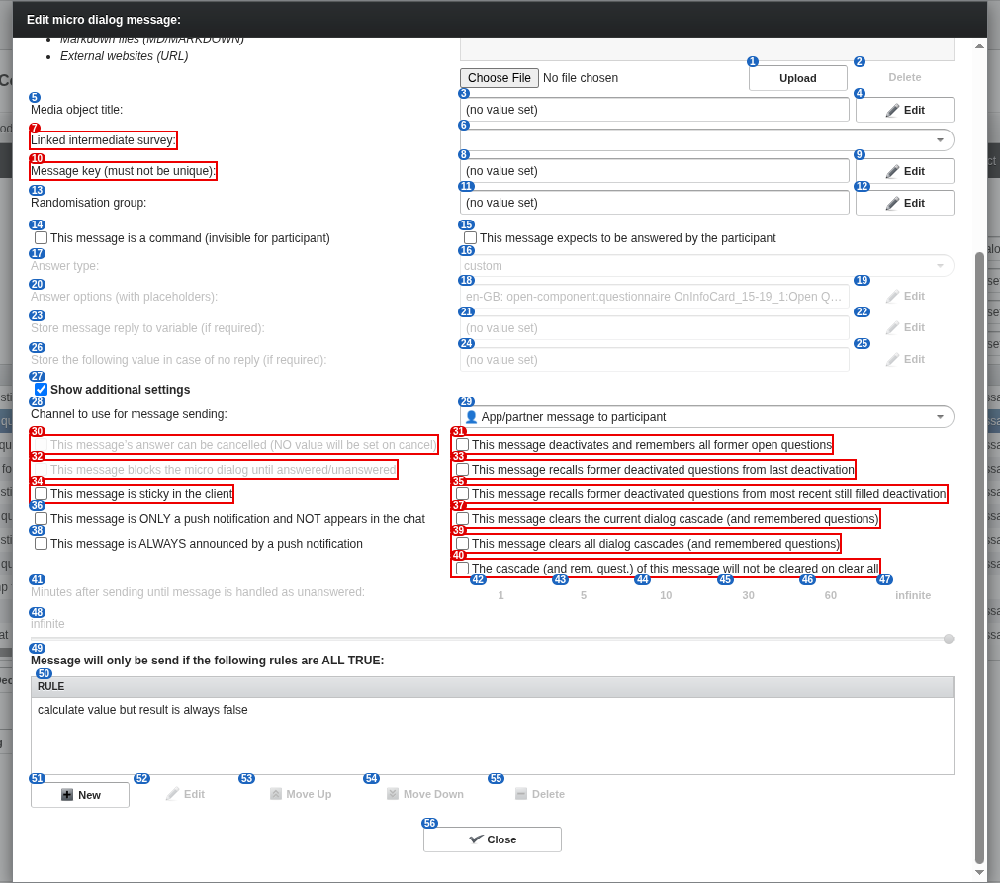

# 24 Message editor (scrolled to the bottom)

alex-sandbox, captured by doc_screens.py. Same editor as 22, scrolled down.

Blue numbers label each control; **red boxes** mark controls whose meaning is unknown.

| # | control | caption | greyed out | open question |
|---|---|---|---|---|
| 1 | button | Upload |  |  |
| 2 | button | Delete | yes |  |
| 3 | label | (no value set) |  |  |
| 4 | button | Edit |  |  |
| 5 | label | Media object title: |  |  |
| 6 | filterselect | (dropdown) |  |  |
| 7 | label | Linked intermediate survey: |  | What does linking an intermediate survey do? |
| 8 | label | (no value set) |  |  |
| 9 | button | Edit |  |  |
| 10 | label | Message key (must not be unique): |  | What is the message key used for? |
| 11 | label | (no value set) |  |  |
| 12 | button | Edit |  |  |
| 13 | label | Randomisation group: |  |  |
| 14 | checkbox | This message is a command (invisible for participant) |  |  |
| 15 | checkbox | This message expects to be answered by the participant |  |  |
| 16 | filterselect | custom | yes |  |
| 17 | label | Answer type: | yes |  |
| 18 | label | en-GB: open-component:questionnaire OnInfoCard_15-19_1:Open Quiz / ro-RO: open-component:questionnaire OnInfoCard_15-19_1:Chestionar deschis | yes |  |
| 19 | button | Edit | yes |  |
| 20 | label | Answer options (with placeholders): | yes |  |
| 21 | label | (no value set) | yes |  |
| 22 | button | Edit | yes |  |
| 23 | label | Store message reply to variable (if required): | yes |  |
| 24 | label | (no value set) | yes |  |
| 25 | button | Edit | yes |  |
| 26 | label | Store the following value in case of no reply (if required): | yes |  |
| 27 | checkbox | Show additional settings |  |  |
| 28 | label | Channel to use for message sending: |  |  |
| 29 | filterselect | 👤 App/partner message to participant |  |  |
| 30 | checkbox | This message’s answer can be cancelled (NO value will be set on cancel) | yes | What does 'cancel' mean for the participant (no value is set)? |
| 31 | checkbox | This message deactivates and remembers all former open questions |  | Exact semantics of deactivating and remembering open questions? |
| 32 | checkbox | This message blocks the micro dialog until answered/unanswered | yes | Exact blocking behaviour: until answered, or also until 'unanswered'? |
| 33 | checkbox | This message recalls former deactivated questions from last deactivation |  | Which questions are recalled, from which deactivation? |
| 34 | checkbox | This message is sticky in the client |  | What does 'sticky in the client' mean? |
| 35 | checkbox | This message recalls former deactivated questions from most recent still filled deactivation |  | What is a 'still filled' deactivation? |
| 36 | checkbox | This message is ONLY a push notification and NOT appears in the chat |  |  |
| 37 | checkbox | This message clears the current dialog cascade (and remembered questions) |  | What is a dialog cascade, and what does clearing it do? |
| 38 | checkbox | This message is ALWAYS announced by a push notification |  |  |
| 39 | checkbox | This message clears all dialog cascades (and remembered questions) |  | Difference to clearing only the current cascade? |
| 40 | checkbox | The cascade (and rem. quest.) of this message will not be cleared on clear all |  | What is protected from 'clear all', and when does clear-all happen? |
| 41 | label | Minutes after sending until message is handled as unanswered: | yes |  |
| 42 | button | 1 | yes |  |
| 43 | button | 5 | yes |  |
| 44 | button | 10 | yes |  |
| 45 | button | 30 | yes |  |
| 46 | button | 60 | yes |  |
| 47 | button | infinite | yes |  |
| 48 | caption | infinite | yes |  |
| 49 | label | Message will only be send if the following rules are ALL TRUE: |  |  |
| 50 | column | Rule |  |  |
| 51 | button | New |  |  |
| 52 | button | Edit | yes |  |
| 53 | button | Move Up | yes |  |
| 54 | button | Move Down | yes |  |
| 55 | button | Delete | yes |  |
| 56 | button | Close |  |  |
