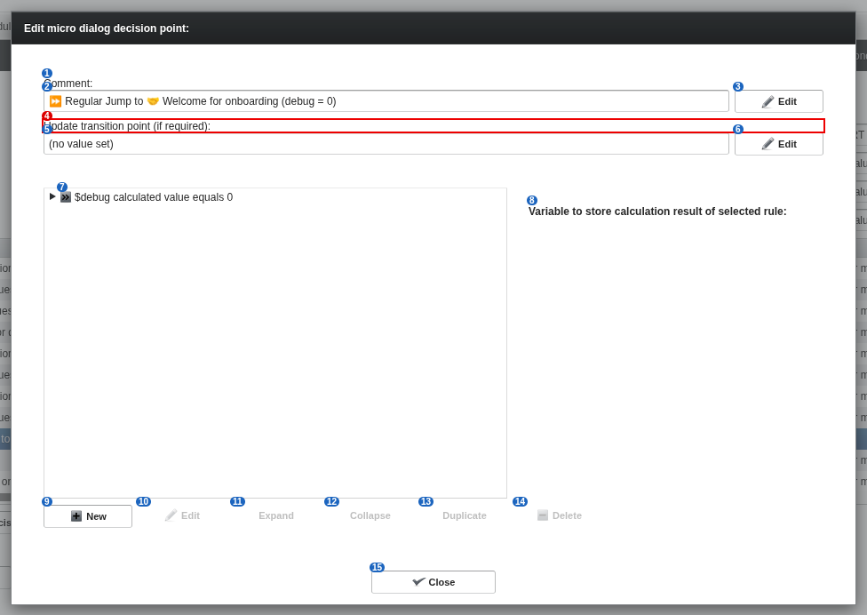

# 30 Decision point editor

alex-sandbox, captured by doc_screens.py.

Blue numbers label each control; **red boxes** mark controls whose meaning is unknown.

| # | control | caption | greyed out | open question |
|---|---|---|---|---|
| 1 | caption | Comment: |  |  |
| 2 | label | ⏩️ Regular Jump to 🤝 Welcome for onboarding (debug = 0) |  |  |
| 3 | button | Edit |  |  |
| 4 | caption | Update transition point (if required): |  | What is a transition point, and what does updating it do? |
| 5 | label | (no value set) |  |  |
| 6 | button | Edit |  |  |
| 7 | rule | $debug calculated value equals 0 |  |  |
| 8 | label | Variable to store calculation result of selected rule: |  |  |
| 9 | button | New |  |  |
| 10 | button | Edit | yes |  |
| 11 | button | Expand | yes |  |
| 12 | button | Collapse | yes |  |
| 13 | button | Duplicate | yes |  |
| 14 | button | Delete | yes |  |
| 15 | button | Close |  |  |
