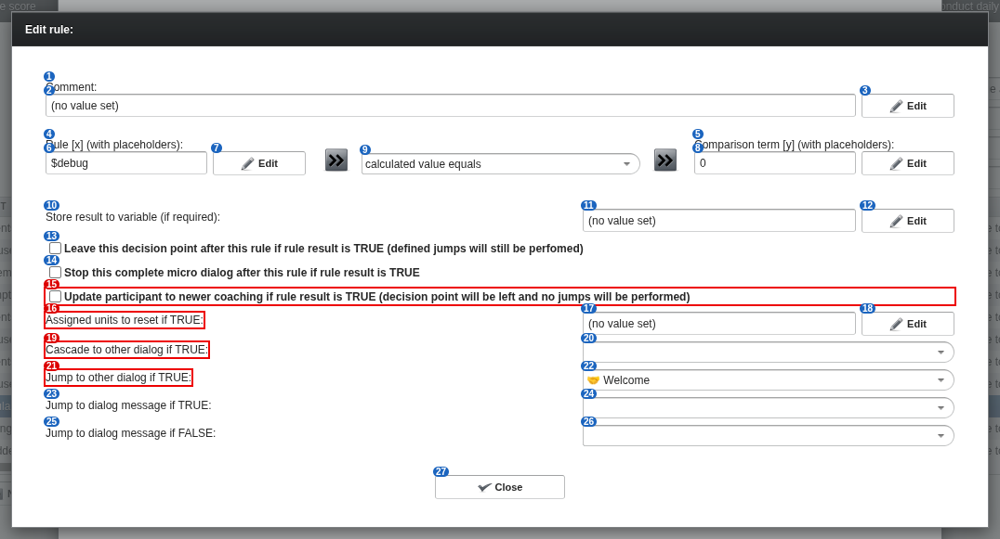

# 31 Decision point: a rule's editor

alex-sandbox, captured by doc_screens.py.

Blue numbers label each control; **red boxes** mark controls whose meaning is unknown.

| # | control | caption | greyed out | open question |
|---|---|---|---|---|
| 1 | caption | Comment: |  |  |
| 2 | label | (no value set) |  |  |
| 3 | button | Edit |  |  |
| 4 | caption | Rule [x] (with placeholders): |  |  |
| 5 | caption | Comparison term [y] (with placeholders): |  |  |
| 6 | label | $debug |  |  |
| 7 | button | Edit |  |  |
| 8 | label | 0 |  |  |
| 9 | filterselect | calculated value equals |  |  |
| 10 | label | Store result to variable (if required): |  |  |
| 11 | label | (no value set) |  |  |
| 12 | button | Edit |  |  |
| 13 | checkbox | Leave this decision point after this rule if rule result is TRUE (defined jumps will still be perfomed) |  |  |
| 14 | checkbox | Stop this complete micro dialog after this rule if rule result is TRUE |  |  |
| 15 | checkbox | Update participant to newer coaching if rule result is TRUE (decision point will be left and no jumps will be performed) |  | What does moving a participant to a newer coaching involve? |
| 16 | label | Assigned units to reset if TRUE: |  | What are 'units', and what does resetting them do? |
| 17 | label | (no value set) |  |  |
| 18 | button | Edit |  |  |
| 19 | label | Cascade to other dialog if TRUE: |  | Difference between CASCADE and JUMP to another dialog? |
| 20 | filterselect | (dropdown) |  |  |
| 21 | label | Jump to other dialog if TRUE: |  | Difference between JUMP and CASCADE to another dialog? |
| 22 | filterselect | 🤝 Welcome |  |  |
| 23 | label | Jump to dialog message if TRUE: |  |  |
| 24 | filterselect | (dropdown) |  |  |
| 25 | label | Jump to dialog message if FALSE: |  |  |
| 26 | filterselect | (dropdown) |  |  |
| 27 | button | Close |  |  |
