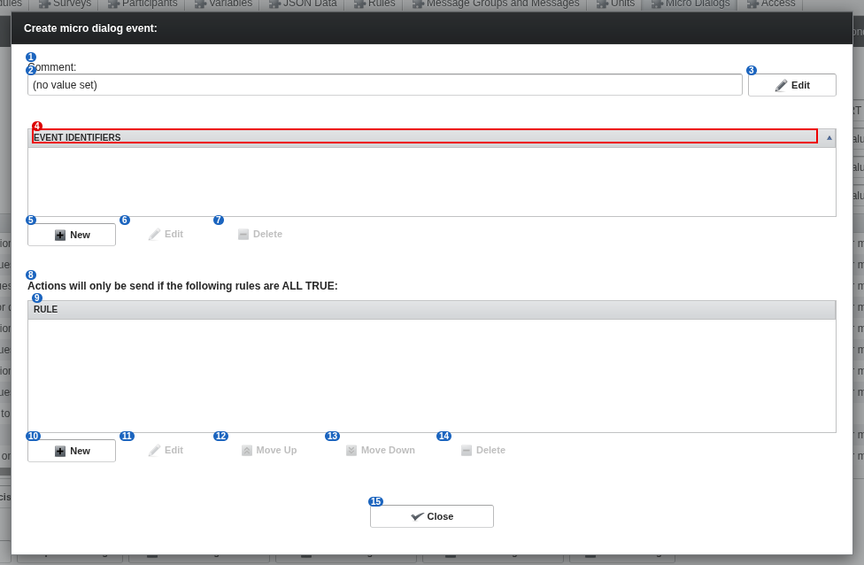

# 40 Event editor ('New Event', not saved)

alex-sandbox, captured by doc_screens.py. Opened with New Event and discarded by reload: no event was created.

Blue numbers label each control; **red boxes** mark controls whose meaning is unknown.

| # | control | caption | greyed out | open question |
|---|---|---|---|---|
| 1 | caption | Comment: |  |  |
| 2 | label | (no value set) |  |  |
| 3 | button | Edit |  |  |
| 4 | column | Event Identifiers |  | Exact format of an event identifier (group.event?), and can several be listed? |
| 5 | button | New |  |  |
| 6 | button | Edit | yes |  |
| 7 | button | Delete | yes |  |
| 8 | label | Actions will only be send if the following rules are ALL TRUE: |  |  |
| 9 | column | Rule |  |  |
| 10 | button | New |  |  |
| 11 | button | Edit | yes |  |
| 12 | button | Move Up | yes |  |
| 13 | button | Move Down | yes |  |
| 14 | button | Delete | yes |  |
| 15 | button | Close |  |  |
