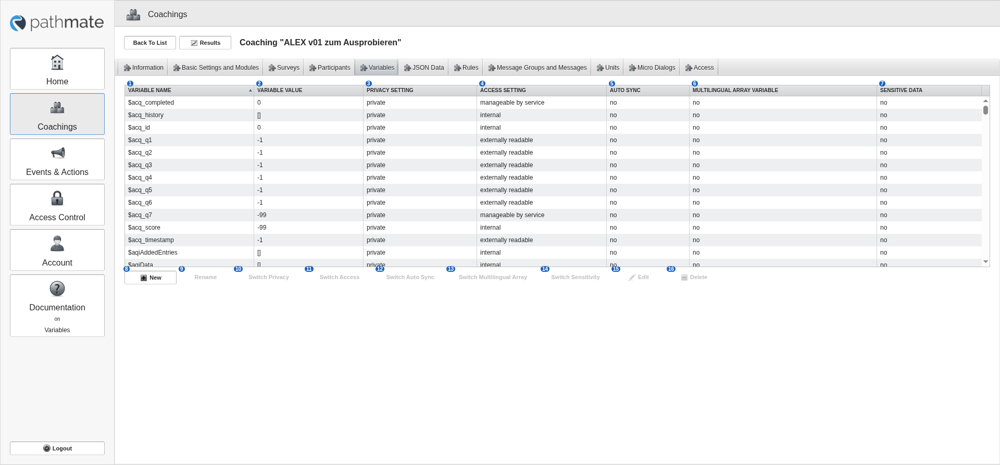

# 50 Variables tab

alex-sandbox, captured by doc_screens.py.

Blue numbers label each control; **red boxes** mark controls whose meaning is unknown.

| # | control | caption | greyed out | open question |
|---|---|---|---|---|
| 1 | column | Variable Name |  |  |
| 2 | column | Variable Value |  |  |
| 3 | column | Privacy Setting |  |  |
| 4 | column | Access Setting |  |  |
| 5 | column | Auto Sync |  |  |
| 6 | column | Multilingual Array Variable |  |  |
| 7 | column | Sensitive Data |  |  |
| 8 | button | New |  |  |
| 9 | button | Rename | yes |  |
| 10 | button | Switch Privacy | yes |  |
| 11 | button | Switch Access | yes |  |
| 12 | button | Switch Auto Sync | yes |  |
| 13 | button | Switch Multilingual Array | yes |  |
| 14 | button | Switch Sensitivity | yes |  |
| 15 | button | Edit | yes |  |
| 16 | button | Delete | yes |  |
